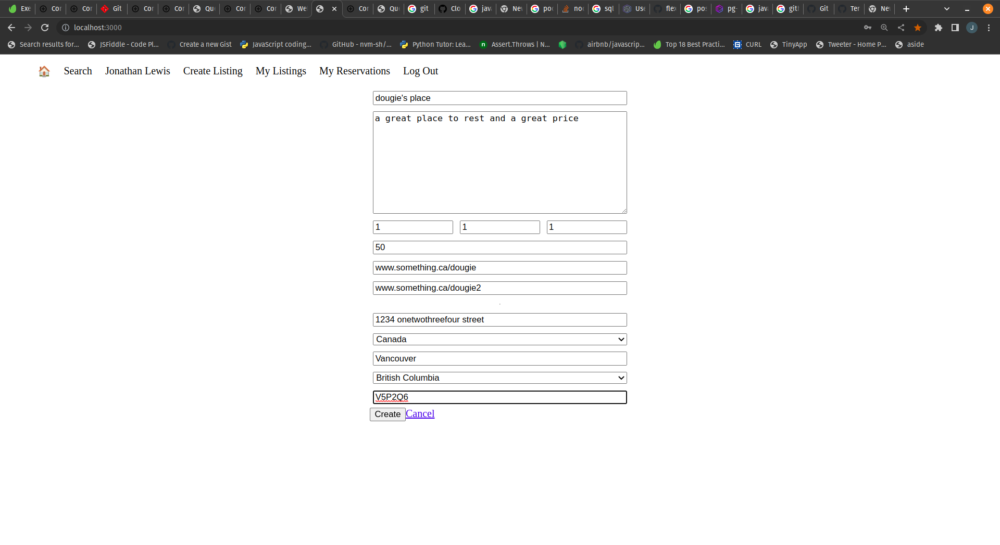
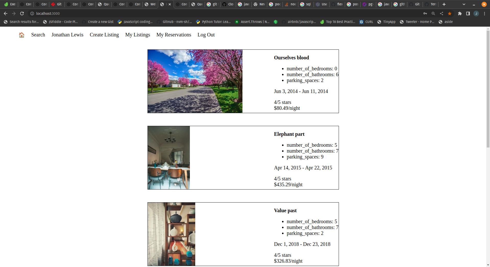
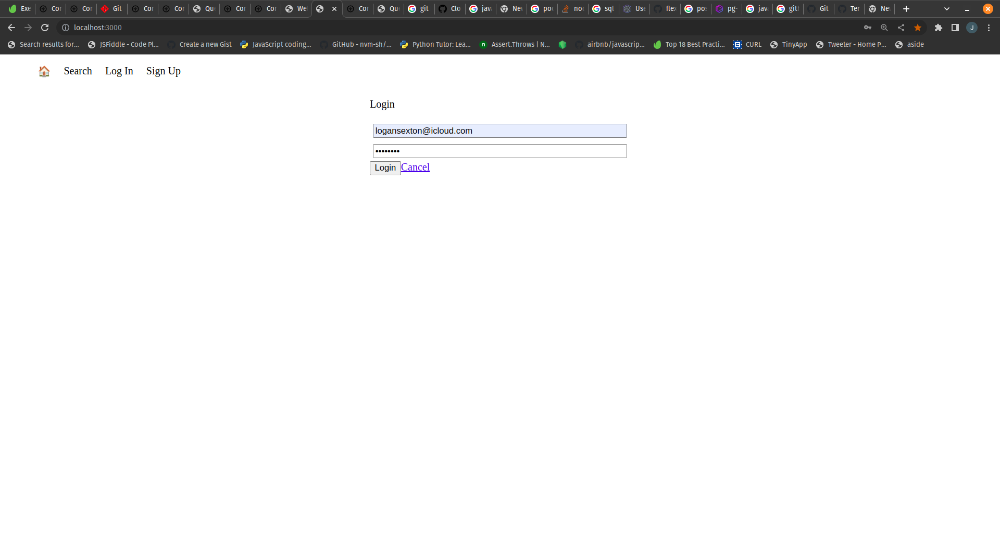

`
# LightBnB

## Project Structure

```
├── public
│   ├── index.html
│   ├── javascript
│   │   ├── components 
│   │   │   ├── header.js
│   │   │   ├── login_form.js
│   │   │   ├── new_property_form.js
│   │   │   ├── property_listing.js
│   │   │   ├── property_listings.js
│   │   │   ├── search_form.js
│   │   │   └── signup_form.js
│   │   ├── index.js
│   │   ├── libraries
│   │   ├── network.js
│   │   └── views_manager.js
│   └── styles
├── sass
└── server
  ├── apiRoutes.js
  ├── database.js
  ├── json
  ├── server.js
  └── userRoutes.js
```

* `public` contains all of the HTML, CSS, and client side JavaScript. 
  * `index.html` is the entry point to the application. It's the only html page because this is a single page application.
  * `javascript` contains all of the client side javascript files.
    * `index.js` starts up the application by rendering the listings.
    * `network.js` manages all ajax requests to the server.
    * `views_manager.js` manages which components appear on screen.
    * `components` contains all of the individual html components. They are all created using jQuery.
* `sass` contains all of the sass files. 
* `server` contains all of the server side and database code.
  * `server.js` is the entry point to the application. This connects the routes to the database.
  * `apiRoutes.js` and `userRoutes.js` are responsible for any HTTP requests to `/users/something` or `/api/something`. 
  * `json` is a directory that contains a bunch of dummy data in `.json` files.
  * `database.js` is responsible for all queries to the database. It doesn't currently connect to any database, all it does is return data from `.json` files.

## Project Images




## To run the app

download from Github
npm install
cd into LightBnB_WebApp-master
in terminal enter npm run local

## To create database

run psql in terminal
use CREATE DATABSE lightbnb
get into the database using \c lightbnb
create tables using \i migrations\01_schema.sql (note: stretch tables contain no data)
import data using \i seeds\01_seeds.sql and 02_seeds.sql


## Websites used while working through this project:
  <If conditions in promises>: https://vijayt.com/post/conditional-promise-chaining-pattern-better-code/ (didn't end up using but referenced)
  <ERD created with>: https://app.diagrams.net/ 


## Dependencies

  "bcrypt": "^3.0.6": https://www.npmjs.com/package/bcrypt
  "body-parser": "^1.19.0": https://www.npmjs.com/package/body-parser
  "cookie-session": "^1.3.3": https://www.npmjs.com/package/cookie-session
  "dotenv": "^16.0.3": https://www.npmjs.com/package/dotenv
  "express": "^4.17.1": https://expressjs.com/
  "nodemon": "^1.19.1": https://www.npmjs.com/package/nodemon
  "pg": "^8.9": https://www.npmjs.com/package/pg 
  